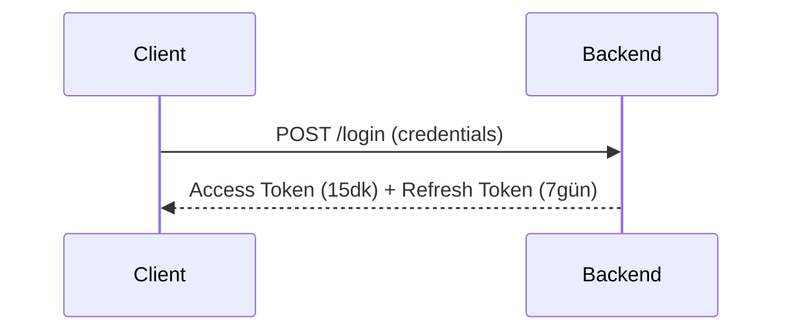
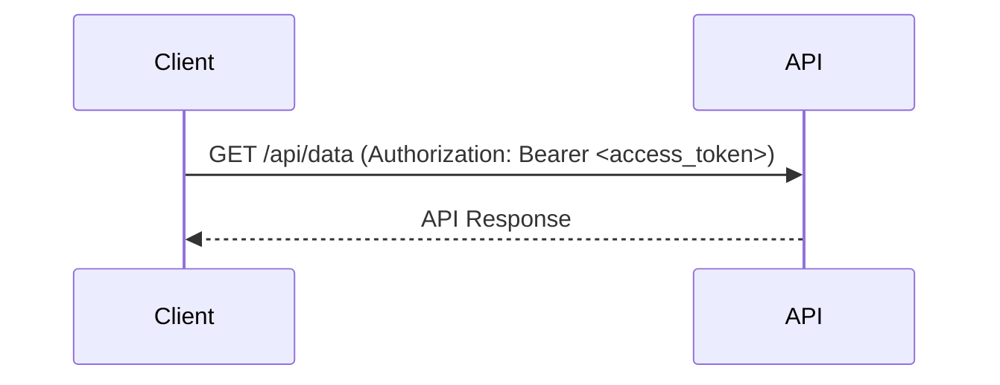
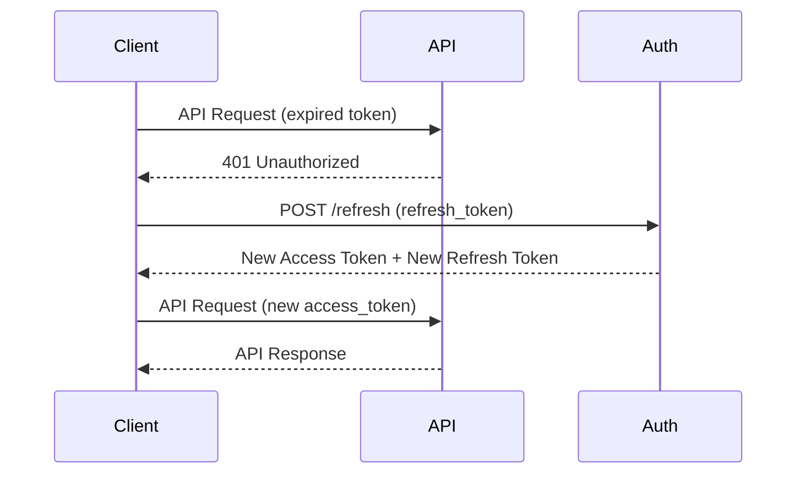

# JWT Authentication: Refresh & Access Token Mekanizması

Bu doküman, JWT tabanlı authentication sistemlerinde refresh ve access token mantığının nasıl çalıştığını açıklamaktadır.

## İçindekiler

- [Genel Bakış](#genel-bakış)
- [Token Türleri](#token-türleri)
- [Çalışma Mantığı](#çalışma-mantığı)
- [Backend Implementation](#backend-implementation)
- [Güvenlik Önlemleri](#güvenlik-önlemleri)
- [Avantajlar](#avantajlar)

## Genel Bakış

JWT authentication sistemi, kullanıcıların güvenli bir şekilde API'lere erişmesini sağlayan iki token tabanlı bir yaklaşımdır:

- **Access Token**: Kısa süreli, API erişimi için kullanılan token
- **Refresh Token**: Uzun süreli, access token'ı yenilemek için kullanılan token

## Token Türleri

### Access Token

| Özellik            | Açıklama                                        |
| ------------------ | ----------------------------------------------- |
| **Yaşam Süresi**   | 15-30 dakika (kısa süreli)                      |
| **Kullanım Alanı** | Her API isteğinde Authorization header'ında     |
| **Güvenlik**       | Expire olduğunda yeniden authentication gerekir |

### Refresh Token

| Özellik            | Açıklama                             |
| ------------------ | ------------------------------------ |
| **Yaşam Süresi**   | 7-30 gün (uzun süreli)               |
| **Kullanım Alanı** | Sadece token yenileme endpoint'inde  |
| **Saklama**        | httpOnly cookie veya güvenli storage |

## Çalışma Mantığı

### 1. İlk Giriş (Login)



### 2. Normal API İstekleri



### 3. Access Token Yenileme



## Backend Implementation

### Token Oluşturma

```javascript
const generateTokens = (user) => {
  const accessToken = jwt.sign(
    { userId: user.id, email: user.email },
    ACCESS_TOKEN_SECRET,
    { expiresIn: "15m" }
  );

  const refreshToken = jwt.sign({ userId: user.id }, REFRESH_TOKEN_SECRET, {
    expiresIn: "7d",
  });

  return { accessToken, refreshToken };
};
```

### Login Endpoint

```javascript
app.post("/login", async (req, res) => {
  try {
    // Kullanıcı doğrulama
    const user = await authenticateUser(req.body.email, req.body.password);

    // Token oluşturma
    const tokens = generateTokens(user);

    // Refresh token'ı database'de sakla
    await saveRefreshToken(user.id, tokens.refreshToken);

    res.json({
      message: "Login successful",
      accessToken: tokens.accessToken,
      refreshToken: tokens.refreshToken,
    });
  } catch (error) {
    res.status(401).json({ error: "Invalid credentials" });
  }
});
```

### Token Yenileme Endpoint

```javascript
app.post("/refresh", async (req, res) => {
  const { refreshToken } = req.body;

  try {
    // Refresh token doğrula
    const decoded = jwt.verify(refreshToken, REFRESH_TOKEN_SECRET);

    // Database'de var mı kontrol et
    const isValid = await validateRefreshToken(refreshToken);
    if (!isValid) {
      throw new Error("Invalid refresh token");
    }

    // Yeni tokenlar oluştur
    const user = await getUserById(decoded.userId);
    const newTokens = generateTokens(user);

    // Token rotation: eski token'ı iptal et, yenisini kaydet
    await replaceRefreshToken(refreshToken, newTokens.refreshToken);

    res.json({
      accessToken: newTokens.accessToken,
      refreshToken: newTokens.refreshToken,
    });
  } catch (error) {
    res.status(401).json({ error: "Invalid refresh token" });
  }
});
```

### Middleware - Token Doğrulama

```javascript
const authenticateToken = (req, res, next) => {
  const authHeader = req.headers["authorization"];
  const token = authHeader && authHeader.split(" ")[1];

  if (!token) {
    return res.status(401).json({ error: "Access token required" });
  }

  jwt.verify(token, ACCESS_TOKEN_SECRET, (err, user) => {
    if (err) {
      return res.status(403).json({ error: "Invalid or expired token" });
    }
    req.user = user;
    next();
  });
};
```

## Güvenlik Önlemleri

### 1. Token Rotation

- Her refresh işleminde hem access hem refresh token yenilenir
- Eski refresh token'lar otomatik olarak geçersiz hale gelir

### 2. Blacklisting

- Kullanılan refresh token'lar database'de işaretlenir
- Aynı token birden fazla kullanılamaz

### 3. Secure Storage

- Refresh token'lar database'de hash'lenerek saklanır
- Client tarafında httpOnly cookie'lerde tutulması önerilir

### 4. HTTPS Zorunluluğu

- Tüm token transferleri HTTPS üzerinden yapılmalıdır
- Production ortamında HTTP trafiği kabul edilmemelidir

### 5. Rate Limiting

```javascript
const rateLimit = require("express-rate-limit");

const refreshLimiter = rateLimit({
  windowMs: 15 * 60 * 1000, // 15 dakika
  max: 5, // Maksimum 5 refresh isteği
  message: "Too many refresh attempts",
});

app.post("/refresh", refreshLimiter, async (req, res) => {
  // Token yenileme logic'i
});
```

## Kullanıcı Deneyimi Detayı

### Refresh Token OLMADAN:

- Access token 15 dakika sonra expire olur
- Kullanıcı her 15 dakikada bir login sayfasına yönlendirilir
- Username/password tekrar girmek zorunda kalır

### Refresh Token İLE:

- Access token 15 dakikada expire olur
- ANCAK kullanıcı bunu fark etmez çünkü:
  - Frontend otomatik olarak refresh token ile yeni access token alır
  - Bu işlem arka planda (background) gerçekleşir
  - Kullanıcı login ekranı görmez
- Kullanıcı 7 gün boyunca (refresh token süresi) kesintisiz kullanmaya devam eder

### Zaman Çizelgesi Örneği

```
Gün 1: Login yap → Access Token (15dk) + Refresh Token (7 gün)
       ↓
Dakika 16: Access token expired → Otomatik yenile → Kullanıcı fark etmez
       ↓
Dakika 31: Access token expired → Otomatik yenile → Kullanıcı fark etmez
       ↓
... bu böyle 7 gün boyunca devam eder ...
       ↓
Gün 7: Refresh token expired → Kullanıcı login sayfasına yönlendirilir
```

### Otomatik Token Yenileme Kodu

```javascript
// Kullanıcı bir API çağrısı yapıyor (access token expired olsa bile)
async function getUserProfile() {
  let response = await fetch("/api/profile", {
    headers: { Authorization: `Bearer ${currentAccessToken}` },
  });

  if (response.status === 401) {
    // Kullanıcı BUNU GÖRMEZ - arka planda olur
    const newAccessToken = await refreshAccessToken();

    // Aynı isteği yeni token ile tekrarla
    response = await fetch("/api/profile", {
      headers: { Authorization: `Bearer ${newAccessToken}` },
    });
  }

  return response.json(); // Kullanıcı sadece bu sonucu görür
}
```

## Güvenlik Riskleri ve Çözümleri

### Risk: Refresh Token Çalınması

Eğer bir saldırgan kullanıcının refresh token'ını ele geçirirse:

**❌ Potansiyel Zararlar:**

- Saldırgan maksimum 7 gün (refresh token süresi) boyunca sisteme erişebilir
- Kullanıcı adına API çağrıları yapabilir
- Hassas verilere erişim sağlayabilir

**✅ Korunma Yöntemleri:**

#### 1. Token Rotation (Otomatik Geçersizleştirme)

```javascript
// Her refresh işleminde eski token geçersiz hale gelir
app.post("/refresh", async (req, res) => {
  const { refreshToken } = req.body;

  // Eski token'ı geçersiz kıl
  await invalidateRefreshToken(refreshToken);

  // Yeni token çifti oluştur
  const newTokens = generateTokens(user);

  // Sadece yeni refresh token geçerli olur
  await saveRefreshToken(user.id, newTokens.refreshToken);

  res.json(newTokens);
});
```

#### 2. Concurrent Usage Detection

```javascript
// Aynı refresh token birden fazla kullanılırsa alarm
app.post("/refresh", async (req, res) => {
  const { refreshToken } = req.body;

  const tokenData = await getRefreshTokenData(refreshToken);

  if (tokenData.isUsed) {
    // Bu token daha önce kullanılmış - güvenlik ihlali!
    await invalidateAllUserTokens(tokenData.userId);
    await logSecurityIncident(
      tokenData.userId,
      "CONCURRENT_REFRESH_TOKEN_USAGE"
    );

    return res.status(401).json({
      error: "Security violation detected. Please login again.",
    });
  }

  // Token'ı kullanıldı olarak işaretle
  await markTokenAsUsed(refreshToken);

  // Yeni tokenlar ver
  const newTokens = generateTokens(user);
  res.json(newTokens);
});
```

#### 3. Device/Location Tracking

```javascript
// Şüpheli lokasyon/cihaz kontrolü
app.post("/refresh", async (req, res) => {
  const { refreshToken } = req.body;
  const clientInfo = {
    ip: req.ip,
    userAgent: req.headers["user-agent"],
    location: await getLocationFromIP(req.ip),
  };

  const storedClientInfo = await getTokenClientInfo(refreshToken);

  if (isDifferentLocation(clientInfo, storedClientInfo)) {
    // Farklı lokasyondan erişim - email gönder
    await sendSecurityAlert(user.email, clientInfo);

    // İsteğe bağlı: token'ı geçersiz kıl
    // await invalidateRefreshToken(refreshToken);
  }

  // Token yenileme devam et...
});
```

#### 4. Short-lived Refresh Tokens

```javascript
// Refresh token süresini kısalt ve otomatik yenile
const generateTokens = (user) => {
  const accessToken = jwt.sign({ userId: user.id }, ACCESS_TOKEN_SECRET, {
    expiresIn: "15m",
  });

  const refreshToken = jwt.sign(
    { userId: user.id },
    REFRESH_TOKEN_SECRET,
    { expiresIn: "2d" } // 7 gün yerine 2 gün
  );

  return { accessToken, refreshToken };
};
```

#### 5. Refresh Token Fingerprinting

```javascript
// Token'a cihaz parmak izi ekle
const generateRefreshToken = (user, deviceFingerprint) => {
  return jwt.sign(
    {
      userId: user.id,
      deviceHash: crypto
        .createHash("sha256")
        .update(deviceFingerprint)
        .digest("hex"),
    },
    REFRESH_TOKEN_SECRET,
    { expiresIn: "7d" }
  );
};

// Doğrulama sırasında fingerprint kontrol et
app.post("/refresh", async (req, res) => {
  const { refreshToken, deviceFingerprint } = req.body;

  const decoded = jwt.verify(refreshToken, REFRESH_TOKEN_SECRET);
  const currentDeviceHash = crypto
    .createHash("sha256")
    .update(deviceFingerprint)
    .digest("hex");

  if (decoded.deviceHash !== currentDeviceHash) {
    return res.status(401).json({
      error: "Device mismatch detected",
    });
  }

  // Token yenileme devam et...
});
```

### Risk Değerlendirmesi

| Saldırı Senaryosu     | Maksimum Hasar    | Korunma Seviyesi                   |
| --------------------- | ----------------- | ---------------------------------- |
| Refresh token çalındı | 7 gün erişim      | ⭐⭐⭐ (Token rotation ile)        |
| Access token çalındı  | 15 dakika erişim  | ⭐⭐⭐⭐⭐ (Çok kısa süre)         |
| Her iki token çalındı | 7 gün erişim      | ⭐⭐⭐ (Ek güvenlik önlemleri ile) |
| Man-in-the-middle     | Token ele geçirme | ⭐⭐⭐⭐⭐ (HTTPS zorunlu)         |

**Sonuç:** Refresh token çalınması ciddi bir güvenlik riskidir, ancak yukarıdaki önlemlerle risk minimize edilebilir. En kritik nokta token rotation ve anomali tespiti sistemlerinin aktif olmasıdır.

### Güvenlik

- **Kısa Access Token Süresi**: Ele geçirilse bile etkisi sınırlı
- **Refresh Token Isolation**: Sadece token yenileme için kullanılır
- **Token Rotation**: Sürekli yenilenen token'lar

### Kullanıcı Deneyimi

- **Seamless Authentication**: Kullanıcı sürekli login olmaz
- **Background Refresh**: Token yenileme kullanıcıya görünmez
- **Session Persistence**: Uzun süreli oturum devamlılığı

### Performans

- **Reduced Database Calls**: Her istekte kullanıcı doğrulama gerekmez
- **Stateless Design**: Server'da session saklamaya gerek yok
- **Scalability**: Horizontal scaling için uygun

## Environment Variables

```bash
# .env dosyası
ACCESS_TOKEN_SECRET=your-super-secret-access-key-here
REFRESH_TOKEN_SECRET=your-super-secret-refresh-key-here
ACCESS_TOKEN_EXPIRE=15m
REFRESH_TOKEN_EXPIRE=7d
```

## Kullanım Örnekleri

### Frontend Implementation (JavaScript)

```javascript
class AuthService {
  async login(email, password) {
    const response = await fetch("/api/login", {
      method: "POST",
      headers: { "Content-Type": "application/json" },
      body: JSON.stringify({ email, password }),
    });

    const data = await response.json();
    localStorage.setItem("accessToken", data.accessToken);
    localStorage.setItem("refreshToken", data.refreshToken);

    return data;
  }

  async refreshToken() {
    const refreshToken = localStorage.getItem("refreshToken");
    const response = await fetch("/api/refresh", {
      method: "POST",
      headers: { "Content-Type": "application/json" },
      body: JSON.stringify({ refreshToken }),
    });

    if (response.ok) {
      const data = await response.json();
      localStorage.setItem("accessToken", data.accessToken);
      localStorage.setItem("refreshToken", data.refreshToken);
      return data.accessToken;
    }

    // Refresh token da geçersizse logout
    this.logout();
    return null;
  }

  async apiCall(url, options = {}) {
    let accessToken = localStorage.getItem("accessToken");

    const response = await fetch(url, {
      ...options,
      headers: {
        ...options.headers,
        Authorization: `Bearer ${accessToken}`,
      },
    });

    if (response.status === 401) {
      // Token refresh et ve tekrar dene
      accessToken = await this.refreshToken();
      if (accessToken) {
        return fetch(url, {
          ...options,
          headers: {
            ...options.headers,
            Authorization: `Bearer ${accessToken}`,
          },
        });
      }
    }

    return response;
  }
}
```

## Best Practices

1. **Token Sürelerini Optimize Edin**: Access token çok kısa, refresh token çok uzun olmamalı
2. **Logout Fonksiyonu**: Çıkış yapılırken tüm token'ları geçersiz hale getirin
3. **Error Handling**: Token yenileme hatalarını uygun şekilde yönetin
4. **Monitoring**: Token kullanım paternlerini izleyin
5. **Testing**: Authentication flow'unu kapsamlı test edin

---
